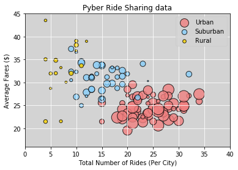
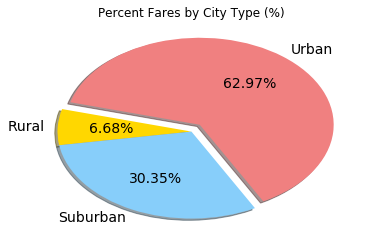
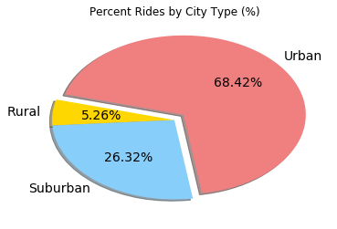
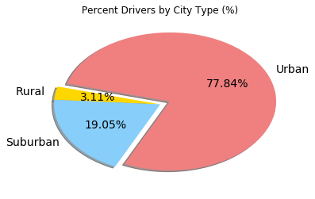

# Pyber Ride Sharing

## Analysis

#### 1)	The lion’s share of the total rides and total fare comes from the Urban areas. 
#### 2)	From the pie charts, 78% of the total drivers are in Urban areas whereas the rides there are only 68% of the total. Which means that Urban areas have way more number of drivers than required. This may be a reason why the fares are lower.
#### 3)	In Suburban areas, the trend is opposite. 26% of the total rides fall under Suburban whereas percentage of the total drivers there is only 19%. The average fares fall above the Urban cluster. Looks like the driver counts need to go up here.
#### 4)	Very less number of people prefer to ride on Pyber in Rural areas and significant low number of drivers. This leads to the fares being higher in these areas.


```python
# Your objective is to build a [Bubble Plot](https://en.wikipedia.org/wiki/Bubble_chart) that showcases the relationship 
# between four key variables:

# Average Fare ($) Per City
# Total Number of Rides Per City
# Total Number of Drivers Per City
# City Type (Urban, Suburban, Rural)

```


```python
import matplotlib.pyplot as plt
import numpy as np
import pandas as pd

```


```python
# city data
city_data_df = pd.read_csv('raw_data/city_data.csv')
city_data_df.head()
```


<div>
<style>
    .dataframe thead tr:only-child th {
        text-align: right;
    }

    .dataframe thead th {
        text-align: left;
    }

    .dataframe tbody tr th {
        vertical-align: top;
    }
</style>
<table border="1" class="dataframe">
  <thead>
    <tr style="text-align: right;">
      <th></th>
      <th>city</th>
      <th>driver_count</th>
      <th>type</th>
    </tr>
  </thead>
  <tbody>
    <tr>
      <th>0</th>
      <td>Kelseyland</td>
      <td>63</td>
      <td>Urban</td>
    </tr>
    <tr>
      <th>1</th>
      <td>Nguyenbury</td>
      <td>8</td>
      <td>Urban</td>
    </tr>
    <tr>
      <th>2</th>
      <td>East Douglas</td>
      <td>12</td>
      <td>Urban</td>
    </tr>
    <tr>
      <th>3</th>
      <td>West Dawnfurt</td>
      <td>34</td>
      <td>Urban</td>
    </tr>
    <tr>
      <th>4</th>
      <td>Rodriguezburgh</td>
      <td>52</td>
      <td>Urban</td>
    </tr>
  </tbody>
</table>
</div>


```python
#locate Port James
port_james = city_data_df.loc[city_data_df["city"] == "Port James",:]
port_james
```


<div>
<style>
    .dataframe thead tr:only-child th {
        text-align: right;
    }

    .dataframe thead th {
        text-align: left;
    }

    .dataframe tbody tr th {
        vertical-align: top;
    }
</style>
<table border="1" class="dataframe">
  <thead>
    <tr style="text-align: right;">
      <th></th>
      <th>city</th>
      <th>driver_count</th>
      <th>type</th>
    </tr>
  </thead>
  <tbody>
    <tr>
      <th>84</th>
      <td>Port James</td>
      <td>15</td>
      <td>Suburban</td>
    </tr>
    <tr>
      <th>100</th>
      <td>Port James</td>
      <td>3</td>
      <td>Suburban</td>
    </tr>
  </tbody>
</table>
</div>


```python
#Add the driver count of same cites in different rows (126 rows since Port James has a duplicate)
drivers_count = city_data_df.groupby("city")["driver_count"].sum()
city_data_new_df = pd.DataFrame({"Total Drivers Per City":drivers_count})
city_data_new_df = city_data_new_df.reset_index()
city_data_new_df.head()
```


<div>
<style>
    .dataframe thead tr:only-child th {
        text-align: right;
    }

    .dataframe thead th {
        text-align: left;
    }

    .dataframe tbody tr th {
        vertical-align: top;
    }
</style>
<table border="1" class="dataframe">
  <thead>
    <tr style="text-align: right;">
      <th></th>
      <th>city</th>
      <th>Total Drivers Per City</th>
    </tr>
  </thead>
  <tbody>
    <tr>
      <th>0</th>
      <td>Alvarezhaven</td>
      <td>21</td>
    </tr>
    <tr>
      <th>1</th>
      <td>Alyssaberg</td>
      <td>67</td>
    </tr>
    <tr>
      <th>2</th>
      <td>Anitamouth</td>
      <td>16</td>
    </tr>
    <tr>
      <th>3</th>
      <td>Antoniomouth</td>
      <td>21</td>
    </tr>
    <tr>
      <th>4</th>
      <td>Aprilchester</td>
      <td>49</td>
    </tr>
  </tbody>
</table>
</div>


```python
#locate Port James
port_james = city_data_new_df.loc[city_data_new_df["city"] == "Port James",:]
port_james
```


<div>
<style>
    .dataframe thead tr:only-child th {
        text-align: right;
    }

    .dataframe thead th {
        text-align: left;
    }

    .dataframe tbody tr th {
        vertical-align: top;
    }
</style>
<table border="1" class="dataframe">
  <thead>
    <tr style="text-align: right;">
      <th></th>
      <th>city</th>
      <th>Total Drivers Per City</th>
    </tr>
  </thead>
  <tbody>
    <tr>
      <th>72</th>
      <td>Port James</td>
      <td>18</td>
    </tr>
  </tbody>
</table>
</div>


```python
#delete duplicate row of Port James in original city data
city_data_df = city_data_df.drop(city_data_df.index[[84]])
port_james = city_data_df.loc[city_data_df["city"] == "Port James",:]
port_james
```


<div>
<style>
    .dataframe thead tr:only-child th {
        text-align: right;
    }

    .dataframe thead th {
        text-align: left;
    }

    .dataframe tbody tr th {
        vertical-align: top;
    }
</style>
<table border="1" class="dataframe">
  <thead>
    <tr style="text-align: right;">
      <th></th>
      <th>city</th>
      <th>driver_count</th>
      <th>type</th>
    </tr>
  </thead>
  <tbody>
    <tr>
      <th>100</th>
      <td>Port James</td>
      <td>3</td>
      <td>Suburban</td>
    </tr>
  </tbody>
</table>
</div>


```python
# merge driver count and city type (125 rows now)
#delete duplicate driver_count column
city_data_new_df = pd.merge(city_data_new_df, city_data_df, on='city', how='left')
city_data_new_df.drop('driver_count', axis=1, inplace=True)

city_data_new_df.head()
```


<div>
<style>
    .dataframe thead tr:only-child th {
        text-align: right;
    }

    .dataframe thead th {
        text-align: left;
    }

    .dataframe tbody tr th {
        vertical-align: top;
    }
</style>
<table border="1" class="dataframe">
  <thead>
    <tr style="text-align: right;">
      <th></th>
      <th>city</th>
      <th>Total Drivers Per City</th>
      <th>type</th>
    </tr>
  </thead>
  <tbody>
    <tr>
      <th>0</th>
      <td>Alvarezhaven</td>
      <td>21</td>
      <td>Urban</td>
    </tr>
    <tr>
      <th>1</th>
      <td>Alyssaberg</td>
      <td>67</td>
      <td>Urban</td>
    </tr>
    <tr>
      <th>2</th>
      <td>Anitamouth</td>
      <td>16</td>
      <td>Suburban</td>
    </tr>
    <tr>
      <th>3</th>
      <td>Antoniomouth</td>
      <td>21</td>
      <td>Urban</td>
    </tr>
    <tr>
      <th>4</th>
      <td>Aprilchester</td>
      <td>49</td>
      <td>Urban</td>
    </tr>
  </tbody>
</table>
</div>


```python
# ride data
ride_data_df = pd.read_csv('raw_data/ride_data.csv')
ride_data_df.head()
#ride_data_df.dtypes
```


<div>
<style>
    .dataframe thead tr:only-child th {
        text-align: right;
    }

    .dataframe thead th {
        text-align: left;
    }

    .dataframe tbody tr th {
        vertical-align: top;
    }
</style>
<table border="1" class="dataframe">
  <thead>
    <tr style="text-align: right;">
      <th></th>
      <th>city</th>
      <th>date</th>
      <th>fare</th>
      <th>ride_id</th>
    </tr>
  </thead>
  <tbody>
    <tr>
      <th>0</th>
      <td>Sarabury</td>
      <td>2016-01-16 13:49:27</td>
      <td>38.35</td>
      <td>5403689035038</td>
    </tr>
    <tr>
      <th>1</th>
      <td>South Roy</td>
      <td>2016-01-02 18:42:34</td>
      <td>17.49</td>
      <td>4036272335942</td>
    </tr>
    <tr>
      <th>2</th>
      <td>Wiseborough</td>
      <td>2016-01-21 17:35:29</td>
      <td>44.18</td>
      <td>3645042422587</td>
    </tr>
    <tr>
      <th>3</th>
      <td>Spencertown</td>
      <td>2016-07-31 14:53:22</td>
      <td>6.87</td>
      <td>2242596575892</td>
    </tr>
    <tr>
      <th>4</th>
      <td>Nguyenbury</td>
      <td>2016-07-09 04:42:44</td>
      <td>6.28</td>
      <td>1543057793673</td>
    </tr>
  </tbody>
</table>
</div>


```python
# Average Fare ($) Per City
city_avg_fare = ride_data_df.groupby("city")["fare"].mean()
#print(city_avg_fare)

# Total Number of Rides Per City
city_total_rides = ride_data_df.groupby("city")["fare"].count()
#print(city_total_rides)

#Create a data frame of thes 2 lists
new_data_df = pd.DataFrame({"Average Fare Per City":city_avg_fare, "Total Rides Per City": city_total_rides})

new_data_df = new_data_df.reset_index()
new_data_df.head()

```


<div>
<style>
    .dataframe thead tr:only-child th {
        text-align: right;
    }

    .dataframe thead th {
        text-align: left;
    }

    .dataframe tbody tr th {
        vertical-align: top;
    }
</style>
<table border="1" class="dataframe">
  <thead>
    <tr style="text-align: right;">
      <th></th>
      <th>city</th>
      <th>Average Fare Per City</th>
      <th>Total Rides Per City</th>
    </tr>
  </thead>
  <tbody>
    <tr>
      <th>0</th>
      <td>Alvarezhaven</td>
      <td>23.928710</td>
      <td>31</td>
    </tr>
    <tr>
      <th>1</th>
      <td>Alyssaberg</td>
      <td>20.609615</td>
      <td>26</td>
    </tr>
    <tr>
      <th>2</th>
      <td>Anitamouth</td>
      <td>37.315556</td>
      <td>9</td>
    </tr>
    <tr>
      <th>3</th>
      <td>Antoniomouth</td>
      <td>23.625000</td>
      <td>22</td>
    </tr>
    <tr>
      <th>4</th>
      <td>Aprilchester</td>
      <td>21.981579</td>
      <td>19</td>
    </tr>
  </tbody>
</table>
</div>


```python
# City Type (Urban, Suburban, Rural)
all_data_df = pd.merge(new_data_df, city_data_new_df, how='left')

all_data_df["Average Fare Per City"] = all_data_df["Average Fare Per City"].map("{:,.2f}".format)

all_data_df.head()

```


<div>
<style>
    .dataframe thead tr:only-child th {
        text-align: right;
    }

    .dataframe thead th {
        text-align: left;
    }

    .dataframe tbody tr th {
        vertical-align: top;
    }
</style>
<table border="1" class="dataframe">
  <thead>
    <tr style="text-align: right;">
      <th></th>
      <th>city</th>
      <th>Average Fare Per City</th>
      <th>Total Rides Per City</th>
      <th>Total Drivers Per City</th>
      <th>type</th>
    </tr>
  </thead>
  <tbody>
    <tr>
      <th>0</th>
      <td>Alvarezhaven</td>
      <td>23.93</td>
      <td>31</td>
      <td>21</td>
      <td>Urban</td>
    </tr>
    <tr>
      <th>1</th>
      <td>Alyssaberg</td>
      <td>20.61</td>
      <td>26</td>
      <td>67</td>
      <td>Urban</td>
    </tr>
    <tr>
      <th>2</th>
      <td>Anitamouth</td>
      <td>37.32</td>
      <td>9</td>
      <td>16</td>
      <td>Suburban</td>
    </tr>
    <tr>
      <th>3</th>
      <td>Antoniomouth</td>
      <td>23.62</td>
      <td>22</td>
      <td>21</td>
      <td>Urban</td>
    </tr>
    <tr>
      <th>4</th>
      <td>Aprilchester</td>
      <td>21.98</td>
      <td>19</td>
      <td>49</td>
      <td>Urban</td>
    </tr>
  </tbody>
</table>
</div>


```python
# Convert Average fare Per City column to numberic
all_data_df["Average Fare Per City"] = pd.to_numeric(all_data_df["Average Fare Per City"], errors='ignore')
#all_data_df.dtypes
```


```python
# Create Scatterplots

# Urban data
urban_type_df = all_data_df.loc[all_data_df["type"] == "Urban",:]
urban_x_axis = urban_type_df["Total Rides Per City"]
urban_y_axis = urban_type_df["Average Fare Per City"]
urban_s = urban_type_df["Total Drivers Per City"]
urban = plt.scatter(urban_x_axis, urban_y_axis, marker="o", facecolors="lightcoral", edgecolors="black", s=(urban_s*5),\
                    alpha=0.8, label="Urban")

# Suburban data
suburban_type_df = all_data_df.loc[all_data_df["type"] == "Suburban",:]
suburban_x_axis = suburban_type_df["Total Rides Per City"]
suburban_y_axis = suburban_type_df["Average Fare Per City"]
suburban_s = suburban_type_df["Total Drivers Per City"]
suburban = plt.scatter(suburban_x_axis, suburban_y_axis, marker="o", facecolors="lightskyblue", edgecolors="black", \
                       s=(suburban_s*5), alpha=0.8, label="Suburban")

# Rural data
rural_type_df = all_data_df.loc[all_data_df["type"] == "Rural",:]
rural_x_axis = rural_type_df["Total Rides Per City"]
rural_y_axis = rural_type_df["Average Fare Per City"]
rural_s = rural_type_df["Total Drivers Per City"]
rural = plt.scatter(rural_x_axis, rural_y_axis, marker="o", facecolors="gold", edgecolors="black", s=(rural_s*5),\
                    alpha=0.8, label="Rural")

# Labels
plt.xlabel('Total Number of Rides (Per City)')
plt.ylabel('Average Fares ($)')
plt.title('Pyber Ride Sharing data')
plt.grid(color="white")


plt.xlim(0, 40)
plt.ylim(16, 45)
plt.legend()
plt.rcParams['axes.facecolor'] = 'lightgray'
plt.show()
```





```python
#ride_data_df.head()
```


```python
# Merge ride data with city data
all_data2_df = pd.merge(ride_data_df, city_data_new_df, on='city', how='left')
all_data2_df.head()
```


<div>
<style>
    .dataframe thead tr:only-child th {
        text-align: right;
    }

    .dataframe thead th {
        text-align: left;
    }

    .dataframe tbody tr th {
        vertical-align: top;
    }
</style>
<table border="1" class="dataframe">
  <thead>
    <tr style="text-align: right;">
      <th></th>
      <th>city</th>
      <th>date</th>
      <th>fare</th>
      <th>ride_id</th>
      <th>Total Drivers Per City</th>
      <th>type</th>
    </tr>
  </thead>
  <tbody>
    <tr>
      <th>0</th>
      <td>Sarabury</td>
      <td>2016-01-16 13:49:27</td>
      <td>38.35</td>
      <td>5403689035038</td>
      <td>46</td>
      <td>Urban</td>
    </tr>
    <tr>
      <th>1</th>
      <td>South Roy</td>
      <td>2016-01-02 18:42:34</td>
      <td>17.49</td>
      <td>4036272335942</td>
      <td>35</td>
      <td>Urban</td>
    </tr>
    <tr>
      <th>2</th>
      <td>Wiseborough</td>
      <td>2016-01-21 17:35:29</td>
      <td>44.18</td>
      <td>3645042422587</td>
      <td>55</td>
      <td>Urban</td>
    </tr>
    <tr>
      <th>3</th>
      <td>Spencertown</td>
      <td>2016-07-31 14:53:22</td>
      <td>6.87</td>
      <td>2242596575892</td>
      <td>68</td>
      <td>Urban</td>
    </tr>
    <tr>
      <th>4</th>
      <td>Nguyenbury</td>
      <td>2016-07-09 04:42:44</td>
      <td>6.28</td>
      <td>1543057793673</td>
      <td>8</td>
      <td>Urban</td>
    </tr>
  </tbody>
</table>
</div>


```python
# In addition, you will be expected to produce the following three pie charts:

## % of Total Fares by City Type

# sum of fares by city type and total fare
sum_fare_type = all_data2_df.groupby('type')["fare"].sum()
total_fare = all_data2_df["fare"].sum()
#print(sum_fare_type)
#print(total_fare)

# % of Total Fares by City Type
percent_fares = sum_fare_type / total_fare * 100
#print(percent_fares)

fares_citytype_df = pd.DataFrame({"Fares by Type": sum_fare_type, "Percent Fare by Type (%)": percent_fares})
fares_citytype_df["Percent Fare by Type (%)"] = fares_citytype_df["Percent Fare by Type (%)"].map('{:.2f}'.format)

# converting the % fare to float
fares_citytype_df["Percent Fare by Type (%)"] = pd.to_numeric(fares_citytype_df["Percent Fare by Type (%)"], errors='ignore')

fares_citytype_df = fares_citytype_df.reset_index()
fares_citytype_df
```


<div>
<style>
    .dataframe thead tr:only-child th {
        text-align: right;
    }

    .dataframe thead th {
        text-align: left;
    }

    .dataframe tbody tr th {
        vertical-align: top;
    }
</style>
<table border="1" class="dataframe">
  <thead>
    <tr style="text-align: right;">
      <th></th>
      <th>type</th>
      <th>Fares by Type</th>
      <th>Percent Fare by Type (%)</th>
    </tr>
  </thead>
  <tbody>
    <tr>
      <th>0</th>
      <td>Rural</td>
      <td>4255.09</td>
      <td>6.68</td>
    </tr>
    <tr>
      <th>1</th>
      <td>Suburban</td>
      <td>19317.88</td>
      <td>30.35</td>
    </tr>
    <tr>
      <th>2</th>
      <td>Urban</td>
      <td>40078.34</td>
      <td>62.97</td>
    </tr>
  </tbody>
</table>
</div>


```python
# Create PieChart for % of Total Fares by City Type
explode=[0, 0, 0.1]
ax = fares_citytype_df.plot(kind='pie', y = 'Percent Fare by Type (%)', autopct='%1.2f%%', startangle=165, shadow=True,\
                       labels=fares_citytype_df['type'], colors=["gold", "lightskyblue", 'lightcoral'],\
                       legend = False, fontsize=14, explode=explode)
#remove the yaxis label
ax.set_ylabel('')
plt.title("Percent Fares by City Type (%)")
plt.show()
```





```python
## % of Total Rides by City Type

# count of rides by city type and total rides
count_rides_type = all_data2_df.groupby('type')["ride_id"].count()
total_rides = len(all_data2_df["ride_id"])
#print(count_rides_type)
#print(total_rides)

# % of Total Rides by City Type
percent_rides = count_rides_type / total_rides * 100
#print(percent_rides)

rides_citytype_df = pd.DataFrame({"Rides by Type": count_rides_type, "Percent Rides by Type (%)": percent_rides}, \
                                columns = ["Rides by Type", "Percent Rides by Type (%)"])
rides_citytype_df["Percent Rides by Type (%)"] = rides_citytype_df["Percent Rides by Type (%)"].map('{:.2f}'.format)

# converting the % ride to float
rides_citytype_df["Percent Rides by Type (%)"] = pd.to_numeric(rides_citytype_df["Percent Rides by Type (%)"], errors='ignore')

rides_citytype_df = rides_citytype_df.reset_index()
rides_citytype_df


```


<div>
<style>
    .dataframe thead tr:only-child th {
        text-align: right;
    }

    .dataframe thead th {
        text-align: left;
    }

    .dataframe tbody tr th {
        vertical-align: top;
    }
</style>
<table border="1" class="dataframe">
  <thead>
    <tr style="text-align: right;">
      <th></th>
      <th>type</th>
      <th>Rides by Type</th>
      <th>Percent Rides by Type (%)</th>
    </tr>
  </thead>
  <tbody>
    <tr>
      <th>0</th>
      <td>Rural</td>
      <td>125</td>
      <td>5.26</td>
    </tr>
    <tr>
      <th>1</th>
      <td>Suburban</td>
      <td>625</td>
      <td>26.32</td>
    </tr>
    <tr>
      <th>2</th>
      <td>Urban</td>
      <td>1625</td>
      <td>68.42</td>
    </tr>
  </tbody>
</table>
</div>


```python
# Create PieChart for % of Total Rides by City Type
explode=[0, 0, 0.1]
ax = rides_citytype_df.plot(kind='pie', y = 'Percent Rides by Type (%)', autopct='%1.2f%%', startangle=165, shadow=True,\
                       labels=rides_citytype_df['type'], colors=["gold", "lightskyblue", 'lightcoral'], legend = False,\
                       fontsize=14, explode=explode)
ax.set_ylabel('')
plt.title("Percent Rides by City Type (%)")
plt.show()
```





```python
#city_data_new_df.head()
```


```python
## % of Total Drivers by City Type

# sum of drivers by city type and total drivers
sum_drivers_type = city_data_new_df.groupby('type')["Total Drivers Per City"].sum()
total_drivers = city_data_new_df["Total Drivers Per City"].sum()
#print(sum_drivers_type)
print(total_drivers)

# % of Total Drivers by City Type
percent_drivers = sum_drivers_type / total_drivers * 100
#print(percent_drivers)

drivers_citytype_df = pd.DataFrame({"Drivers by Type": sum_drivers_type, "Percent Drivers by Type (%)": percent_drivers}, \
                                columns = ["Drivers by Type", "Percent Drivers by Type (%)"])
drivers_citytype_df["Percent Drivers by Type (%)"] = drivers_citytype_df["Percent Drivers by Type (%)"].map('{:.2f}'.format)

# converting the % ride to float
drivers_citytype_df["Percent Drivers by Type (%)"] = pd.to_numeric(drivers_citytype_df["Percent Drivers by Type (%)"], \
                                                                   errors='ignore')

drivers_citytype_df = drivers_citytype_df.reset_index()
drivers_citytype_df
```

    3349
    


<div>
<style>
    .dataframe thead tr:only-child th {
        text-align: right;
    }

    .dataframe thead th {
        text-align: left;
    }

    .dataframe tbody tr th {
        vertical-align: top;
    }
</style>
<table border="1" class="dataframe">
  <thead>
    <tr style="text-align: right;">
      <th></th>
      <th>type</th>
      <th>Drivers by Type</th>
      <th>Percent Drivers by Type (%)</th>
    </tr>
  </thead>
  <tbody>
    <tr>
      <th>0</th>
      <td>Rural</td>
      <td>104</td>
      <td>3.11</td>
    </tr>
    <tr>
      <th>1</th>
      <td>Suburban</td>
      <td>638</td>
      <td>19.05</td>
    </tr>
    <tr>
      <th>2</th>
      <td>Urban</td>
      <td>2607</td>
      <td>77.84</td>
    </tr>
  </tbody>
</table>
</div>


```python
# Create PieChart for % of Total Drivers by City Type

explode=[0, 0, 0.1]
ax = drivers_citytype_df.plot(kind='pie', y = 'Percent Drivers by Type (%)', autopct='%1.2f%%', startangle=165, shadow=True,\
                       labels=drivers_citytype_df['type'], colors=["gold", "lightskyblue", 'lightcoral'], \
                         legend = False, fontsize=14, explode=explode)

ax.set_ylabel('')
plt.title("Percent Drivers by City Type (%)")
plt.show()
```




